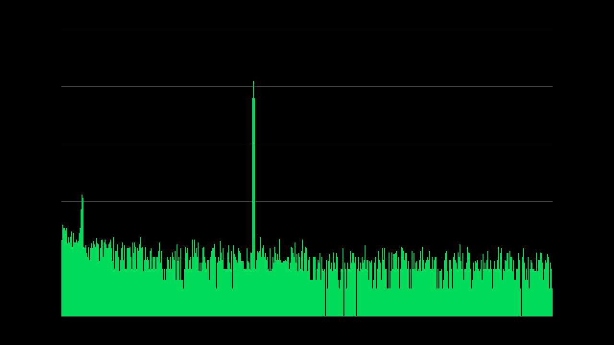

# 12 — HDMI demo: live microphone spectrum on a monitor

Plan: `docs/plans/hdmi-demo.md`. Requested by the advisor after the FFT benchmark report:
microphone → Tang Nano 20K → Gowin FFT → spectrum on a monitor over the board's HDMI port.

| Step | What | Status |
|---|---|---|
| **H1** | Colour test pattern at 1280×720, 60 Hz | ✅ 2026-10-09 |
| **H2** | Spectrum of a test tone generated inside the FPGA | ✅ 2026-10-09 |
| H3 | Live spectrum from the INMP441 microphone | ⏳ built + simulated; mic connection unstable |
| H4 | Gridlines, kHz/dB labels, peak readout | — |

---

## 1. How HDMI sends a picture

**A frame is more than the visible picture.** After every line and every frame comes invisible
*blanking* time. It's a leftover from CRT monitors (the beam needed time to fly back), and it is
where the sync pulses live: **HSYNC** = "new line", **VSYNC** = "new frame". The exact totals are
fixed by the standard (CEA-861), which is how a monitor recognises the format:

```
 ◀──────────────────────── 1650 slots per line ─────────────────────────▶
 ┌──────────────────────────────────────┬──────┬──────┬──────────────────┐ ▲
 │                                      │front │ sync │   back porch     │ │
 │        VISIBLE PICTURE 1280 × 720    │porch │  40  │      220         │ │ 720 lines
 │                                      │ 110  │      │                  │ │
 ├──────────────────────────────────────┴──────┴──────┴──────────────────┤ ▼
 │  vertical blanking: 5 front porch + 5 sync + 20 back porch = 30 lines │
 └───────────────────────────────────────────────────────────────────────┘
   1280 + 370 = 1650 slots per line,   720 + 30 = 750 lines per frame
```

**Each pixel travels as bits.** A pixel is 3 colours × 8 bits. HDMI has one wire pair per
colour; each 8-bit value is coded into a **10-bit TMDS word** and sent one bit after another,
bit 0 first. A fourth pair carries the clock.

**TMDS coding** (DVI 1.0, `src/hdmi/tmds_encoder.v`) solves two problems of a fast cable:
1. *Fewer transitions:* the byte is rewritten as an XOR (or XNOR) chain, whichever toggles
   less; bit 8 records which.
2. *Balance of 1s and 0s:* a running count of "1s minus 0s" is kept, and a word is sent
   inverted when the count leans one way; bit 9 records the inversion.

During blanking, one of four fixed control words is sent instead; on the blue lane they carry
HSYNC and VSYNC. The monitor undoes both steps, so the colours arrive unchanged.

## 2. The clocks: why 371.25 MHz is fine

```
 27 MHz crystal ─▶ rPLL ×55 ÷4 ─▶ 371.25 MHz ─────────────▶ 4 × OSER10 serializers ONLY
                                      └─▶ CLKDIV ÷5 ─▶ 74.25 MHz ─▶ timing, pattern, TMDS encoders
 27 MHz crystal ──────────────────────────────────────────▶ ESP32 UART benchmark (unchanged)
```

| Clock | Calculation | Used by |
|---|---|---|
| **74.25 MHz** pixel clock | 1650 × 750 slots × 60 frames | everything that makes the picture |
| **371.25 MHz** serializer clock | 74.25 M pixels × 10 bits = 742.5 Mbit/s per wire; sent on both clock edges → ÷2 | only the 4 serializers |

- **OSER10** is a serializer built into the pin's I/O block: it takes 10 bits once per pixel and
  shifts them out at the fast clock. It is designed for this speed; our own logic never sees
  that clock (like a cashier handing 10 coins at a time to a fast coin machine).
- **TLVDS_OBUF** drives each serial bit as a differential pair (P/N), as HDMI needs.
- PLL: VCO = 371.25 × 2 = 742.5 MHz (allowed 500–1250). The same numbers as Sipeed's official
  20K HDMI example, whose pin list (33–40) is also used here.
- **No IP core was generated**: rPLL, CLKDIV, OSER10 and TLVDS_OBUF are Gowin built-in blocks
  used directly in Verilog.

## 3. H1: colour test pattern

### 3.1 The picture

| Element | Checks |
|---|---|
| 8 colour bars (white, yellow, cyan, green, magenta, red, blue, black) | each colour lane wired correctly |
| 1-pixel white border | the whole 1280×720 is visible, nothing cropped |
| grey ramp, black → white | all 8 bits of each colour arrive |
| moving 40×40 square (4 px per frame) | the picture is live |

### 3.2 Simulation first, down to the serial bits

`fpga_fft/sim/tb_hdmi.v` runs the picture chain with **Gowin's own models** of CLKDIV and OSER10
and records every bit leaving the 4 lanes (2 frames, ~25 million bits, ~2.5 min in Icarus).
`fpga_fft/sim/check_hdmi.py` then decodes the stream **like a monitor**: word alignment from the
clock lane, TMDS decoding, sync recovery, and a pixel-by-pixel comparison.

| Check (complete frame between two VSYNCs) | Result |
|---|---|
| clock lane = 5 zeros + 5 ones per pixel | ✅ 100 % |
| 720 visible lines × 1280 pixels; 1650 slots/line; 750 lines/frame | ✅ exact |
| HSYNC 40, front porch 110, back porch 220 | ✅ exact |
| VSYNC 5 lines, starting at line 725, slot 1390, together with HSYNC | ✅ exact |
| DC balance within each line, all 3 lanes | ✅ worst running 1s − 0s: 9 |
| **every visible pixel decoded back to the expected colour** | ✅ **0 of 921,600 differ** |

Found and fixed on the way:
1. **VSYNC started one slot after HSYNC** (it passed through one register too many). The
   standard starts them together. Fixed in `video_timing.v`.
2. The moving square stepped once per clock during reset (`frame_start` wasn't gated by
   reset), so it started at x = 84 instead of 4. Cosmetic; fixed.
3. Gowin's CLKDIV model only starts counting after a low-to-high step on `RESETN`. On the
   chip, `RESETN` is the PLL's lock signal, which does exactly that; the testbench now mimics it.

### 3.3 Build and hardware result

| | Value |
|---|---|
| Logic / registers | 2,046 (10 %) / 789, including the ESP32 benchmark |
| Pixel clock | needs 74.25 MHz, timing met up to 93.3 MHz |
| Benchmark clock | needs 27 MHz, met up to 83.9 MHz |
| ESP32 benchmark inside the HDMI build | echo 26 / 26 ✅ |
| **Monitor (4K, 27")** | **picture exactly as designed; monitor reports 1280×720 @ 60 Hz** ✅ |

The 4K monitor scales the picture itself: 3840 ÷ 1280 = 2160 ÷ 720 = 3, so each pixel is shown
as a clean 3×3 block.

```bash
DESIGN=hdmi fpga_fft/build.sh program          # build + load the HDMI design
iverilog -g2012 -s tb_hdmi -o /tmp/tb_hdmi fpga_fft/sim/tb_hdmi.v fpga_fft/src/hdmi/*.v \
    /Applications/GowinIDE.app/Contents/Resources/Gowin_EDA/IDE/simlib/gw2a/prim_sim.v
vvp /tmp/tb_hdmi +out=/tmp/hdmi_bits.txt && python fpga_fft/sim/check_hdmi.py /tmp/hdmi_bits.txt
```

---

## 4. H2: spectrum of a test tone

### 4.1 The chain

```
 tone_gen ─▶ gain ─▶ clamp ─▶ × Hann ─▶ ping-pong ─▶ Gowin FFT ─▶ re²+im² ─▶ log2 ─▶ height ─▶ bar memory ─▶ screen
 (48.3 kHz)  (param) (param)   window    buffer      (2nd core,    (power)              (px)     (2 halves,
                                         2 × 1024     74.25 MHz)                                 swap in blanking)
```

| Block (`src/hdmi/`) | Job |
|---|---|
| `tone_gen.v` | Test signal at the microphone's sample rate (74.25 MHz ÷ 1536 = 48,339.8 Hz): a half-scale tone sweeping 0 → 24 kHz in ~10 s, plus a fixed 1 kHz tone 40 dB quieter. Each tone is a phase accumulator (a 32-bit counter stepping once per sample) indexing a 1024-entry sine table |
| `spectrum.v` | Gain (`GAIN_SHIFT`) and clamp (`CLAMP`, default 32,700) — both parameters to tune for the microphone; Hann window; two-half sample buffer; a second Gowin FFT core; power = re² + im² for bins 0–511; height in pixels |
| `bar_display.v` | 512 bars × 2 px from x = 128, gridlines every 20 dB; double-buffered heights, swapped during vertical blanking |
| `rom_sine.v`, `rom_hann.v` | Lookup tables, generated by `fpga_fft/gen_tables.py` |

### 4.2 The dB scale: why 0 dB is at the top

dB compares a value with a **reference**. Here the reference is the **largest value an FFT bin
can hold, 32,767** ("full scale", 0 dBFS). Nothing can be bigger, so 0 dB is the ceiling at the
top, and every real signal is negative, further down. Each 20 dB down is 10× smaller:

| Bin value | Fraction of max | dB | Screen |
|---|---|---|---|
| 32,767 | 1 | 0 dB | top (600 px) |
| 3,277 | 1/10 | −20 dB | 2nd gridline |
| 328 | 1/100 | −40 dB | 3rd gridline |
| 33 | 1/1,000 | −60 dB | 4th gridline |
| 3 | 1/10,000 | −80 dB | 5th gridline |
| 0.3 | 1/100,000 | −100 dB | bottom |

On a linear scale the 1 kHz tone (1/100 of the main tone) would be 1 % as tall: invisible. The
dB scale shows strong and weak signals on one screen.

**How the height is computed in hardware** (6 px per dB, 0 dB at 600 px, −100 dB at 0 px):
height = 60·log10(P) + 58.15 with P = re² + im² (P = 32,767² is 0 dB). log10 is avoided:
log2(P) = position of P's highest 1-bit + a 32-entry table for the fraction (in 1/32 steps,
L = 32·log2 P), then **height = (289·L + 29,773) / 512**, clipped to 0…600.

**Why the main tone shows at −18 dB:** half-scale input (−6 dB) → a real tone's energy splits
between bin k and its mirror 1024 − k (−6 dB) → the Hann window halves the average (−6 dB).

### 4.3 Timing: does each step keep up?

| Step | Time | Margin |
|---|---|---|
| Collect 1,024 samples (one every 1,536 clocks) | 21.2 ms | — |
| FFT on a finished block | 7,190 clocks = 0.097 ms | 0.5 % of the time available |
| Power → dB → height | one bin per clock during the FFT's unload, +6 clocks | — |
| New bars on screen | at the next vertical blanking (≤ 16.7 ms) | never mid-picture: no tearing |

The two-half buffer means the FFT works on one half while the other fills: no sample is lost.
`overrun` (LED 4) would light if a block arrived while the FFT was still busy; it can't
happen with this margin, and it stayed off.

### 4.4 Simulation

| Check (`sim/tb_h2_audio.v`, `sim/tb_h2_video.v`, `sim/check_h2.py`) | Result |
|---|---|
| Tone samples vs a Python model of the phase accumulators | **bit-exact** (2,497 samples) |
| Windowed block vs gain/clamp/Hann in Python | **bit-exact** |
| FFT (Gowin gate-level model) vs numpy | correct, 2.54 LSB rms |
| 512 heights vs the formula applied to the FFT output | **bit-exact** |
| Tone 1 (fixed at bin 200) / tone 2 (1 kHz) | bin 200 at −18.2 dB / bin 21, 39.5 dB lower |
| Everything away from the tones | below −68 dB |
| One full frame of pixels vs the layout | **0 of 921,600 differ** |

In simulation a sample comes every 16 clocks instead of 1,536 (frequencies are set per sample,
so the spectrum is the same) to keep the gate-level FFT run to ~7 s.



*The simulated frame: tone at bin 200 (−18 dB), the 1 kHz tone (−58 dB) on the left, and the
FFT's own rounding noise as "grass" around −80 dB — the noise floor from the benchmark, now
visible.*

Caught before the hardware: a hand-typed log2 table with 12 of 32 entries off by one (now
generated), and a testbench that stopped before the FFT's mirror half was out.

### 4.5 Build and hardware result

| | Value |
|---|---|
| Logic / registers | 3,199 (16 %) / 1,190 |
| Block RAM | 19 / 46: benchmark FFT 6 + demo FFT 6 + benchmark buffer 2 + sample buffer 2 + sine 1 + Hann 1 + bars 1 |
| DSP | 7 / 24 |
| Pixel clock | needs 74.25 MHz, met up to 81.5 MHz |
| ESP32 benchmark in the same build | passes |
| **Monitor** | **the tone sweeps across the screen as designed** ✅ |

---

## 5. H3: the live microphone (in progress)

### 5.1 Two ways in, both selectable with button S1

| Source | Path | Modules |
|---|---|---|
| ESP32 relay (default) | INMP441 → ESP32 I2S → UART 2.97 Mbaud (GPIO17 → pin 27) → FPGA | `firmware/mic_relay`, `relay_rx.v` |
| Test tone | as in H2 | `tone_gen.v` |
| Direct | INMP441 → FPGA pins 25 (SCK), 26 (WS), 29 (SD) | `mic_source.v` + `fpga/src/i2s_master_rx.v` (new 24-bit output) |

Both microphone paths use `gain24.v`: the 16-bit sample is a window of the 24-bit word, moved
down 0…7 bits (+0…+42 dB, button S2, start +24 dB), saturated, then clamped to ±32,700.
Relay packet: `B5 6A | seq | 32 × 24-bit (LE) | sum16` = 101 bytes, 1,500 /s, 51 % of the link;
a packet with a wrong sum is dropped, one that stalls 1 ms is abandoned.

### 5.2 Verified in simulation

| Test | Result |
|---|---|
| `tb_h3_mic`: the audio project's INMP441 model, 8 gain copies | bit-exact incl. saturation; SCK exactly 24 clocks (3.09 MHz), a sample every 1,536 clocks |
| `tb_h3_relay`: packets at the ESP32's real baud (2,969,838) | 192 / 192 samples bit-exact; corrupted packet dropped; half packet abandoned |
| `fpga/sim/run_sims.sh` (audio project, shared `i2s_master_rx`) | all pass |

### 5.3 On the hardware: the microphone connection is unstable

| Observation | Meaning |
|---|---|
| Direct path: SD never high (diagnostic LEDs) | the mic never started |
| ESP32 `mic_test`: data alternates between clean audio, silence and scrambled words | the mic keeps restarting: its clock or power keeps dropping for moments |
| After re-seating the wires: clean 220 Hz / 1 kHz in `inmp441_viewer.py` | the mic itself works |
| Later, same firmware: scrambled again (correlation +0.4) | the contact loosened again |

Changes made for margin: FPGA SCK/WS drive 4 mA (weakest), ESP32 SCK/WS weakest drive, SD
pull-down on both (INMP441 datasheet). **Next:** solder the module's header pins, use short
wires, or try another module; then test both paths on the monitor.
